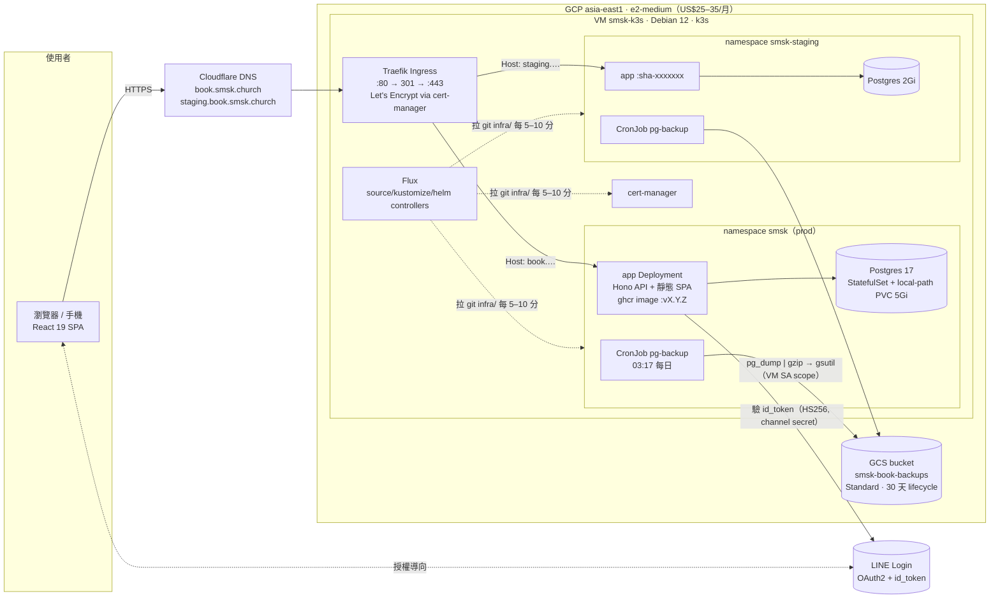
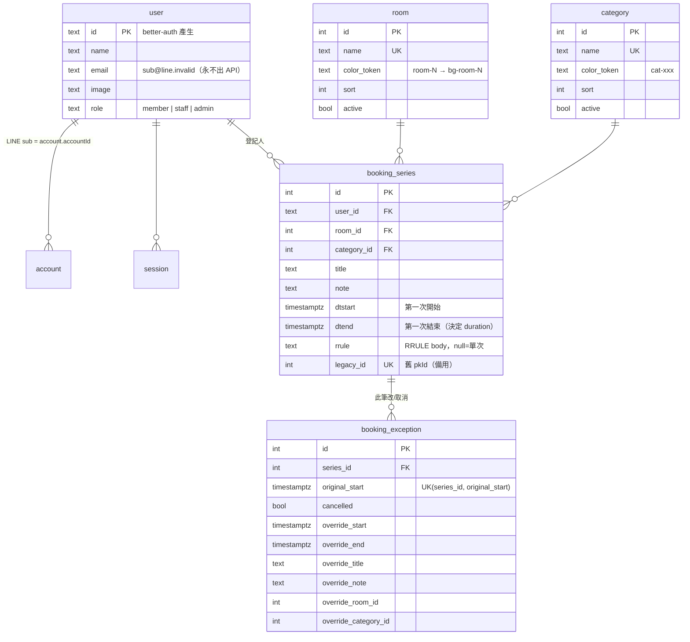
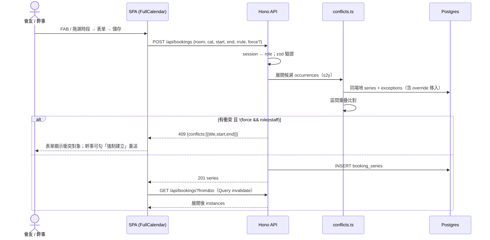
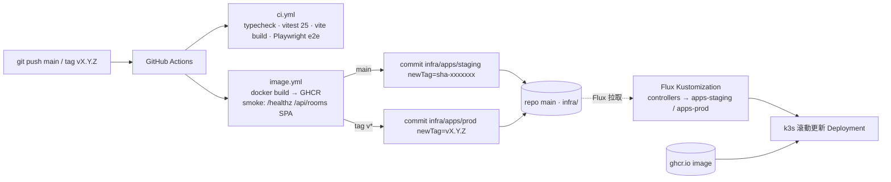

# System Design — 石門教會場地登記 v2

> 對應 Phase 2–4 實作（2026-08-16）。決策理由在 `docs/decisions.md`，操作在 `infra/README.md`。

## 1. Runtime 拓撲（GCP 單 VM + k3s）



**紀律**：無 GCP Load Balancer（Traefik 直綁 VM static IP）、無第二台 VM（staging 用 namespace）、20GB pd-standard、無 Ops Agent、無 Cloud SQL。

## 2. 應用內部（單一容器）

```mermaid
flowchart TB
  subgraph IMG["ghcr.io/mushding/shimen-church-book-system（node:22-alpine, tsx）"]
    direction TB
    S[serveStatic /assets/*, SPA fallback<br/>apps/web/dist] 
    H[Hono app.ts<br/>zod-validator · role middleware<br/>Hono RPC AppType]
    BA[better-auth<br/>generic-oauth line() + HS256 覆寫<br/>session cookie 30d 滑動]
    SVC[bookings.ts<br/>create / patch(this·following·all) / delete]
    REC[recur.ts<br/>RRULE 展開（台北 +8 固定平移）<br/>exception 套用]
    CF[conflicts.ts<br/>同場地區間重疊 → 409 + force]
    DR[Drizzle ORM<br/>DATABASE_URL → node-postgres<br/>否則 pglite（dev/test）]
  end
  H --> BA
  H --> SVC --> REC
  SVC --> CF --> REC
  SVC --> DR
  BA --> DR
  H --> S
```

前端（`apps/web`）：TanStack Router（`/`、`/admin`）+ Query → `hc<AppType>()` 型別直通 → FullCalendar v7 吃 **server 展開後的 instance**（`GET /api/bookings?from&to`），不自己算 rrule。

## 3. 資料模型



一筆登記 = 一個 `booking_series`；「此筆」→ `booking_exception`；「此後」→ 舊 series 截 UNTIL + 新 series；「全部」→ 改 series。

## 4. 建立登記（含衝突）時序



## 5. CI/CD → GitOps



回滾 = 把 overlay `newTag` 改回舊值 push。Secrets 不進 git（`kubectl create secret` 每 ns 一次；要 git 化再上 SOPS）。

## 6. 邊界與取捨
- **時區**：台灣無 DST → 用固定 +8 平移展開 RRULE，不用 rrule tzid（server/client 同一套）。
- **可見度**：未登入可看行事曆（標題/場地/時間/類別）；人名/頭像需登入；email 永不出 API。
- **權限**：member 動自己的；staff 動別人的 + force；admin 管場地/類別/角色。
- **不做**：LINE 通知、審核流程、雙語營模式、歷史資料遷移（舊資料已遺失）。
- **已知上限**：衝突偵測 O(n·m)（同場地兩年內 occurrences，數百級）；無限 rrule 只查 2 年；單 VM 單 Postgres 無 HA（備份每日）。
